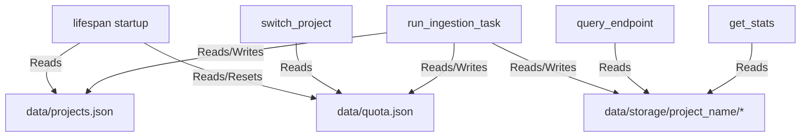

# Aether | Real-Time Ingestion Engine

## Overview
Aether utilizes a native, "Always-on" file watcher system to ensure that the semantic index remains a high-fidelity mirror of your local filesystem.

## 1. The Sentinel (File Watcher)
The `ProjectWatcher` class in `src/aether/core/watcher.py` leverages the `watchdog` library to monitor the active project directory.

### Event Triggers
Aether responds to three primary event types:
*   **Created:** When a new file is added.
*   **Modified:** When an existing file is saved.
*   **Deleted:** When a file is removed.

### Debounce Logic (Quota Preservation)
To prevent rapid-fire indexing and protect Google Gemini API quotas, Aether implements a **5-second debounce period**.
*   **Logic:** Once an event is detected, any subsequent changes within the next 5 seconds are ignored.
*   **Reasoning:** This allows for "save bursts" (like a formatter running or multiple rapid edits) to be processed as a single logical ingestion task.

## 2. Incremental Ingestion (Refresh Pattern)
Aether does not re-index the entire project on every change. Instead, it uses the **incremental refresh** pattern:

1.  **Scan:** The engine performs a shallow scan of file metadata.
2.  **Compare:** It compares the current filesystem hashes with the hashes stored in `docstore.json`.
3.  **Surgical Update:** Only files that have been added or modified since the last sync are embedded via the Google Gemini API.
4.  **Purge:** Any nodes associated with deleted files are automatically removed from the vector index.

Example Flow:
`Syncing /path/to/project -> /path/to/aether/data/storage/project`

## 3. Lazy Loading & Memory
Aether is optimized for a "Zero-Impact" background presence:
*   **Startup Behavior:** The vector index is NOT loaded into RAM upon server startup.
*   **Lazy Loading:** The index is only pulled into memory during the first `POST /query` of a session.
*   **Release API:** The `/release` endpoint allows you to purge the index from RAM and trigger garbage collection (`gc.collect()`) without stopping the server.
*   **Project Switching:** On a project switch via `POST /switch`, the active index is cleared and `gc.collect()` is called to completely release the prior index's memory.

## 4. Ingestion Pipeline
When a client sends a `POST /ingest` request, the ingestion process is executed in a background task thread through the following stages:

1.  **Quota Verification**: The system loads the daily quota configuration via `_load_quota()`. If the total processed embedding calls exceed `embed_limit` (default: 900 batches/day), the ingestion halts immediately, transitioning the status to `quota_exceeded`.
2.  **Task Launch**: If quota is available, the server sets `sync_status["status"] = "syncing"` and adds `run_ingestion_task` to the FastAPI `BackgroundTasks` queue.
3.  **Engine Invocation**: The background task invokes `run_ingestion` in `engine.py`, which resolves the project storage directory and offloads the CPU/network-intensive work to a worker thread via `asyncio.to_thread`.
4.  **Sync Execution**: The thread executes `sync_local_dir_custom()` in `ingest.py`. It instantiates a `SimpleDirectoryReader` configured with `filename_as_id=True` and directories to exclude (including defaults and project-specific `exclude_dirs`). The execution follows one of two paths:
    *   **Initial Indexing (No docstore.json)**: Instantiates a clean `VectorStoreIndex([])` and inserts documents in batches of 5. It invokes `index.storage_context.persist(persist_dir=storage_dir)` after every successful batch and sleeps for 2 seconds.
    *   **Incremental Refresh (docstore.json exists)**: Loads the existing index using `load_index_from_storage(storage_context)`. It iterates through documents in batches of 5, calling `index.refresh_ref_docs(batch)`. It persists the index to disk via `index.storage_context.persist(persist_dir=storage_dir)` after each batch and sleeps for 2 seconds. In case of 429 or 503 rate limiting responses from the Google API, a backoff sleep (15s, 30s, etc.) is applied with up to 5 retries. Stale files that no longer exist on disk are identified and deleted using `index.delete_ref_doc(doc_id)`.
5.  **Final State Update**: After the loop finishes, the total `batch_count` (which represents the `embed_calls_used`) is returned. The task runner updates the active project's `last_ingested` timestamp in `projects.json`, increments the daily quota counter in `quota.json`, resets `sync_status["pending_changes"] = False`, and sets `sync_status["status"] = "idle"`.

*Note: The per-batch `persist()` call is a key reliability feature. If a long ingestion is interrupted by a terminal rate-limit error or network timeout halfway through, all preceding successfully processed batches are saved to disk, preserving progress and avoiding the billing cost of re-embedding those files.*

## 5. Data Flow
Below is the metadata and file state read/write diagram for Aether operations:

### Summary
*   **Startup**: The server lifespan reads `projects.json` to load project paths, and `quota.json` to configure the daily limit (resetting the count if a new day has started).
*   **Switching**: A project switch reads `quota.json` to refresh quota limits and restarts the file watcher.
*   **Ingestion**: Reads and updates `quota.json` and `projects.json` (updating the sync timestamp). It reads from and writes to the `storage/` directory for the active project (loading the index state and persisting batches).
*   **Querying & Stats**: Read the `storage/` directory to query the vector index and compute file metrics.

## 6. Quota Management
*   **embed_calls_today Tracking**: Embedding usage is tracked at the batch level (where 1 batch processes up to 5 documents).
*   **Date-Reset Behavior**: `_load_quota()` parses `data/quota.json`. If the current date string (UTC) does not match the `"date"` attribute in the file, it automatically resets `embed_calls` to `0` and writes the reset ledger to disk.
*   **Quota Ceiling**: A default limit of 900 batches/day is enforced. If an ingest task is triggered but the current count matches or exceeds the limit, Aether flags `quota_exceeded` and exits without making any API calls.
*   **Strategic Improvement Plan**: See [docs/specs/QUOTA_EFFICIENCY.md](file:///home/chadh/survivaltools/Aether/docs/specs/QUOTA_EFFICIENCY.md) for specs on implementing adaptive throttling, debounce optimizations, and client-side caching.

## 7. Known Inactive Code
The following functions reside in `src/aether/core/ingest.py` but are currently inactive:
*   `sync_local_dir(dir_path, project_name)`: A legacy wrapper for local directory syncing. This function is fully superseded by `sync_local_dir_custom()` which accepts explicit directory exclusion lists.
*   `sync_github_repo(owner, repo, branch)`: A stub loader for retrieving and embedding GitHub repositories using `GithubRepositoryReader`. Currently, no API routes or watcher integrations are wired to use this feature.

*Note: These functions are preserved in the codebase for potential future capability expansions and should not be removed.*
